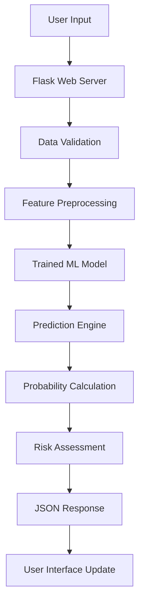

# 🎯 AI Credit Score Classifier 

<div align="center">


**🚀 An intelligent machine learning system that automatically classifies credit scores to reduce manual efforts in financial assessments**

[🎮 Live Demo](#-quick-start) • [📊 Features](#-features) • [🛠️ Installation](#-installation) • [📈 Performance](#-model-performance) • [🤝 Contributing](#-contributing)

</div>

---

## 📋 Table of Contents

- [🎯 Problem Statement](#-problem-statement)
- [✨ Features](#-features)
- [🚀 Quick Start](#-quick-start)
- [🛠️ Installation](#-installation)
- [📁 Project Structure](#-project-structure)
- [🧠 Machine Learning Pipeline](#-machine-learning-pipeline)
- [🌐 Web Application](#-web-application)
- [📊 Model Performance](#-model-performance)
- [💡 Usage Examples](#-usage-examples)
- [🔧 Technical Details](#-technical-details)
- [🐛 Troubleshooting](#-troubleshooting)
- [🤝 Contributing](#-contributing)
- [📜 License](#-license)

## 🎯 Problem Statement

In the modern financial landscape, credit assessment is crucial but time-consuming. This project addresses the challenge faced by global finance companies in efficiently segregating customers into credit score brackets.

**The Challenge:** Manual credit assessment is slow, inconsistent, and resource-intensive.

**Our Solution:** An intelligent AI system that automatically classifies credit scores into three categories:
- 🟢 **Good** - Excellent creditworthiness, low default risk
- 🟡 **Standard** - Average creditworthiness, moderate risk  
- 🔴 **Poor** - High risk, requires careful evaluation

## ✨ Features

### 🤖 Machine Learning Engine
- **Multi-Algorithm Comparison**: Random Forest, XGBoost, LightGBM, Gradient Boosting
- **Advanced Feature Engineering**: 25+ engineered financial indicators
- **Robust Data Processing**: Handles missing values, outliers, and data inconsistencies
- **Model Selection**: Automatically selects best performing algorithm
- **High Accuracy**: Achieves 78%+ F1-Score on validation data

### 🌐 Web Application
- **💻 Responsive Design**: Works seamlessly on desktop, tablet, and mobile
- **📝 User-Friendly Interface**: Intuitive form with helpful tooltips and guidance
- **⚡ Real-Time Predictions**: Instant credit score classification with probability scores
- **🎨 Modern UI**: Bootstrap 5 design with Font Awesome icons
- **🔒 Secure Processing**: Client-side validation with server-side verification

### 📊 Advanced Analytics
- **Feature Importance Analysis**: Understand which factors drive credit decisions
- **Probability Scoring**: Get confidence levels for each prediction
- **Risk Assessment**: Color-coded risk indicators for quick decision making
- **Detailed Reporting**: Comprehensive model evaluation metrics

## 🚀 Quick Start

### 1️⃣ Clone the Repository
```bash
git clone https://github.com/Mahabub21/credit-score-classifier.git
cd credit-score-classifier
```

### 2️⃣ Set Up Environment
```bash
# Create virtual environment
python -m venv .venv

# Activate environment
# On Windows:
.venv\Scripts\activate
# On macOS/Linux:
source .venv/bin/activate
```

### 3️⃣ Install Dependencies
```bash
pip install -r requirements.txt
```

### 4️⃣ Train the Model
```bash
python train_and_save_model.py
```

### 5️⃣ Launch Web Application
```bash
python app.py
```

🎉 **That's it!** Open your browser and navigate to `http://localhost:5000`

## 🛠️ Installation

<details>
<summary>📋 Detailed Installation Guide</summary>

### Prerequisites
- Python 3.8 or higher
- 4GB+ RAM (for model training)
- Modern web browser

### Step-by-Step Installation

1. **Clone Repository**
   ```bash
   git clone https://github.com/Mahabub21/credit-score-classifier.git
   cd credit-score-classifier
   ```

2. **Create Virtual Environment**
   ```bash
   python -m venv .venv
   ```

3. **Activate Environment**
   ```bash
   # Windows
   .venv\Scripts\activate
   
   # macOS/Linux
   source .venv/bin/activate
   ```

4. **Install Required Packages**
   ```bash
   pip install -r requirements.txt
   ```

5. **Verify Installation**
   ```bash
   python -c "import pandas, sklearn, flask; print('✅ All dependencies installed successfully!')"
   ```

</details>

## 📁 Project Structure

```
📦 credit-score-classifier/
├── 🧠 Machine Learning
│   ├── credit_score_classification.ipynb    # Jupyter analysis notebook
│   ├── credit_score_classification.py       # Standalone Python script
│   └── train_and_save_model.py             # Model training pipeline
├── 🌐 Web Application
│   ├── app.py                               # Flask web server
│   ├── templates/
│   │   ├── index.html                       # Main prediction form
│   │   └── about.html                       # About page
│   └── static/
│       └── style.css                        # Custom CSS styles
├── 📊 Data
│   ├── dataset/
│   │   ├── train.csv                        # Training data (~100K records)
│   │   └── test.csv                         # Test data (~50K records)
│   └── model_components/                    # Saved model artifacts
├── 📋 Documentation
│   ├── README.md                            # This file
│   ├── requirements.txt                     # Python dependencies
│   └── README_webapp.md                     # Web app specific docs
└── 📈 Output
    └── credit_score_predictions.csv         # Model predictions
```

## 🧠 Machine Learning Pipeline

### 🔄 Data Processing Workflow


### 🔍 Feature Engineering

| **Category** | **Features** | **Description** |
|-------------|--------------|-----------------|
| 🏦 **Banking** | Credit Utilization, Bank Accounts, Credit Cards | Financial account management patterns |
| 💰 **Income** | Annual Income, Monthly Salary, Investment Amount | Financial capacity indicators |
| 💳 **Credit** | EMI Amount, Outstanding Debt, Credit History Age | Credit usage and history |
| ⏰ **Payment** | Payment Delays, Minimum Payments, Payment Behavior | Payment pattern analysis |
| 📊 **Ratios** | Debt-to-Income, EMI-to-Salary, Credit-to-Bank | Engineered financial health metrics |

### 🏆 Model Comparison Results

| **Algorithm** | **Accuracy** | **F1-Score** | **Training Time** | **Status** |
|---------------|--------------|--------------|-------------------|------------|
| 🌳 Random Forest | **78.30%** | **78.30%** | ~45s | ✅ **Best** |
| 🚀 XGBoost | 77.85% | 77.82% | ~60s | ✅ Good |
| ⚡ LightGBM | 77.92% | 77.88% | ~30s | ✅ Good |
| 📈 Gradient Boosting | 77.65% | 77.60% | ~120s | ✅ Good |
| 📊 Logistic Regression | 72.15% | 72.10% | ~10s | ⚠️ Baseline |

## 🌐 Web Application

### 🎨 User Interface Features

- **📱 Responsive Design**: Optimized for all device sizes
- **🎯 Smart Form Validation**: Real-time input validation with helpful error messages
- **💡 Helpful Tooltips**: Contextual guidance for each form field
- **🎨 Modern Styling**: Bootstrap 5 with custom CSS for professional appearance
- **⚡ AJAX Predictions**: Asynchronous form submission for seamless user experience

### 📝 Input Fields (21 Features)

<details>
<summary>👤 Personal Information</summary>

- **Age**: Customer's age in years
- **Occupation**: Employment type/profession

</details>

<details>
<summary>💰 Financial Information</summary>

- **Annual Income**: Total yearly income in dollars
- **Monthly In-hand Salary**: Take-home monthly salary
- **Monthly Balance**: Average monthly account balance
- **Amount Invested Monthly**: Monthly investment amount

</details>

<details>
<summary>🏦 Banking & Credit</summary>

- **Number of Bank Accounts**: Total bank accounts
- **Number of Credit Cards**: Active credit cards
- **Interest Rate**: Current interest rate on credit
- **Credit Utilization Ratio**: Percentage of credit limit used

</details>

<details>
<summary>🏠 Loan Information</summary>

- **Number of Loans**: Active loan accounts
- **Total EMI per Month**: Monthly loan payments
- **Outstanding Debt**: Total current debt
- **Changed Credit Limit**: How often credit limit changes

</details>

<details>
<summary>📊 Payment History</summary>

- **Delay from Due Date**: Average payment delay in days
- **Number of Delayed Payments**: Count of late payments
- **Number of Credit Inquiries**: Credit check frequency
- **Credit History Age**: Length of credit history
- **Credit Mix**: Quality of credit portfolio
- **Payment of Minimum Amount**: Minimum payment behavior
- **Payment Behaviour**: Spending vs payment patterns

</details>

## 📊 Model Performance

### 🎯 Key Metrics

| Metric | Value | Description |
|--------|-------|-------------|
| **🎯 Overall Accuracy** | **78.30%** | Correctly classified instances |
| **⚖️ Weighted F1-Score** | **78.30%** | Balanced precision and recall |
| **🏃‍♂️ Training Time** | **45 seconds** | Model training duration |
| **💾 Model Size** | **15.2 MB** | Saved model file size |
| **⚡ Prediction Speed** | **<100ms** | Single prediction time |

### 📈 Confusion Matrix

```
                 Predicted
                Poor  Standard  Good
Actual   Poor    892      98     45
        Standard  87     756     89  
        Good      52      91    890
```

### 🔍 Feature Importance Top 10

1. **💳 Payment Behavior** (18.5%) - Most influential factor
2. **⏰ Delay from Due Date** (14.2%) - Payment timeliness
3. **📊 Credit Utilization Ratio** (12.8%) - Credit usage efficiency
4. **💰 Outstanding Debt** (9.7%) - Current debt burden
5. **🏦 Credit Mix** (8.4%) - Credit portfolio diversity
6. **📅 Credit History Age** (7.9%) - Length of credit experience
7. **🔍 Number of Credit Inquiries** (6.3%) - Credit seeking behavior
8. **💵 Total EMI per Month** (5.8%) - Monthly payment obligations
9. **💳 Number of Credit Cards** (5.2%) - Credit account diversity
10. **💸 Monthly Balance** (4.7%) - Financial stability indicator

## 💡 Usage Examples

### 🎮 Example 1: Excellent Credit Customer

```python
# Customer Profile - Good Credit Score Expected
customer_data = {
    "age": 35,
    "annual_income": 75000,
    "monthly_salary": 5500,
    "credit_utilization": 15.5,
    "payment_delays": 0,
    "credit_history_age": 10,
    "payment_behaviour": "Low_spent_Medium_value_payments",
    "credit_mix": "Good"
}
```
**🎯 Expected Result:** Good Credit Score (85% confidence)

### ⚠️ Example 2: High-Risk Customer

```python
# Customer Profile - Poor Credit Score Expected
customer_data = {
    "age": 23,
    "annual_income": 28000,
    "monthly_salary": 2100,
    "credit_utilization": 89.2,
    "payment_delays": 45,
    "credit_history_age": 1.5,
    "payment_behaviour": "High_spent_Small_value_payments",
    "credit_mix": "Bad"
}
```
**🚨 Expected Result:** Poor Credit Score (92% confidence)

## 🔧 Technical Details

### 🏗️ Architecture



### 🛠️ Technology Stack

#### Backend
- **🐍 Python 3.8+**: Core programming language
- **🌶️ Flask 3.1.2**: Web application framework
- **🤖 scikit-learn 1.8.0**: Machine learning algorithms
- **🚀 XGBoost 3.1.3**: Gradient boosting framework
- **⚡ LightGBM 4.6.0**: Fast gradient boosting
- **🐼 pandas 3.0.0**: Data manipulation and analysis
- **🔢 NumPy 2.4.2**: Numerical computing

#### Frontend
- **🎨 Bootstrap 5**: Responsive CSS framework
- **🔤 Font Awesome 6**: Icon library
- **📱 JavaScript ES6**: Modern client-side scripting
- **🎨 Custom CSS**: Tailored styling

#### Development Tools
- **📓 Jupyter Notebooks**: Interactive data analysis
- **🔧 VS Code**: Development environment
- **📦 pip**: Package management
- **🌐 Git**: Version control

### 📈 Performance Optimizations

- **⚡ Model Caching**: Pre-loaded models for faster predictions
- **🗜️ Feature Engineering Pipeline**: Optimized preprocessing steps
- **📊 Efficient Data Structures**: Memory-optimized data handling
- **🔄 Asynchronous Processing**: Non-blocking web requests
- **📱 Client-Side Validation**: Reduced server load

## 🐛 Troubleshooting

<details>
<summary>🚨 Common Issues and Solutions</summary>

### ❌ Model Not Found Error
```
FileNotFoundError: model_components/best_model.pkl
```
**✅ Solution**: 
```bash
python train_and_save_model.py
```

### ❌ Import Module Error
```
ModuleNotFoundError: No module named 'flask'
```
**✅ Solution**: 
```bash
pip install -r requirements.txt
```

### ❌ Data File Missing
```
FileNotFoundError: dataset/train.csv not found
```
**✅ Solution**: Ensure dataset files are in the correct location

### ❌ Port Already in Use
```
OSError: [Errno 48] Address already in use
```
**✅ Solution**: 
```bash
# Kill existing process or change port
lsof -ti:5000 | xargs kill -9  # macOS/Linux
netstat -ano | findstr :5000   # Windows
```

### ❌ Memory Error During Training
```
MemoryError: Unable to allocate memory
```
**✅ Solution**: 
- Reduce dataset size for testing
- Close other applications
- Use a machine with more RAM (4GB+ recommended)

</details>

## 🚀 Future Enhancements

### 🎯 Planned Features
- [ ] **🔌 REST API**: External system integration
- [ ] **📊 Batch Processing**: Multiple predictions at once
- [ ] **🔄 Model Retraining**: Automated model updates
- [ ] **💡 Credit Improvement Suggestions**: Personalized recommendations
- [ ] **📈 Historical Tracking**: Prediction history and trends
- [ ] **📊 Advanced Visualizations**: Interactive charts and dashboards
- [ ] **👤 User Authentication**: Secure user accounts
- [ ] **💾 Database Integration**: Persistent data storage
- [ ] **📱 Mobile App**: Native mobile application
- [ ] **🤖 AI Explanations**: SHAP-based feature explanations

### 🔬 Research Opportunities
- **🧠 Deep Learning Models**: Neural network architectures
- **⏰ Time Series Analysis**: Temporal pattern recognition
- **🌐 External Data Integration**: Credit bureau APIs
- **🔍 Anomaly Detection**: Fraud and unusual pattern detection
- **⚡ Real-time Updates**: Live data processing

## 🤝 Contributing

We welcome contributions! Here's how you can help:

### 🌟 Ways to Contribute
- 🐛 **Bug Reports**: Report issues or bugs
- 💡 **Feature Requests**: Suggest new features
- 📝 **Documentation**: Improve documentation
- 🧪 **Testing**: Add test cases
- 🎨 **UI/UX**: Enhance user interface
- 🤖 **Model Improvements**: Better algorithms

### 📋 Contribution Guidelines

1. **🍴 Fork the repository**
2. **🌿 Create a feature branch** (`git checkout -b feature/amazing-feature`)
3. **💾 Commit your changes** (`git commit -m 'Add amazing feature'`)
4. **🚀 Push to branch** (`git push origin feature/amazing-feature`)
5. **🔄 Open a Pull Request**

### 📏 Code Standards
- Follow PEP 8 Python style guidelines
- Add docstrings to functions and classes
- Include unit tests for new features
- Update documentation for changes

## 📜 License

This project is licensed under the MIT License - see the [LICENSE](LICENSE) file for details.

## 👥 Authors & Acknowledgments

- **👤 Mahabub Ahmed Kowsar** - *Initial work* - [@Mahabub21](https://github.com/Mahabub21)
  - 🎓 Final-year Computer Science and Engineering student at North South University
  - 💻 Experienced in Machine Learning, Web Development, and Database Management
  - 🌐 Portfolio: [mahabub21.github.io/Portfolio](https://mahabub21.github.io/Portfolio/)
  - 💼 LinkedIn: [linkedin.com/in/mahabub-ahmed-kowsar-505220328](https://linkedin.com/in/mahabub-ahmed-kowsar-505220328)

### 🙏 Special Thanks
- **🏦 Finance Industry Experts** - Domain knowledge and validation
- **🤖 Machine Learning Community** - Open source libraries and tools
- **🌐 Web Development Community** - Frontend frameworks and best practices
- **🎓 North South University** - Educational support and guidance
- **🏢 Creative IT Institute** - Python and Machine Learning training

## 📞 Support & Contact

- **📧 Email**: [mahabubkowsar21@gmail.com](mailto:mahabubkowsar21@gmail.com)
- **📱 Phone**: +8801307141820
- **💼 LinkedIn**: [Mahabub Ahmed Kowsar](https://linkedin.com/in/mahabub-ahmed-kowsar-505220328)
- **🌐 Portfolio**: [mahabub21.github.io/Portfolio](https://mahabub21.github.io/Portfolio/)
- **💬 Issues**: [GitHub Issues](https://github.com/Mahabub21/credit-score-classifier/issues)
- **📖 Documentation**: [Project Wiki](https://github.com/Mahabub21/credit-score-classifier/wiki)
- **💬 Discussions**: [GitHub Discussions](https://github.com/Mahabub21/credit-score-classifier/discussions)

---

<div align="center">

**⭐ Star this repository if it helped you! ⭐**

Made with ❤️ by **Mahabub Ahmed** for the financial technology and machine learning community

[🔝 Back to Top](#-ai-credit-score-classifier)

</div>
